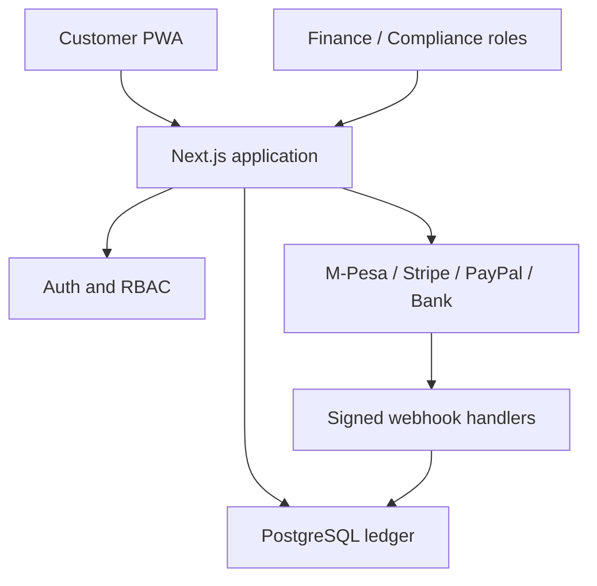

# Architecture

## Application shape

The browser receives only presentation data and an HTTP-only opaque session cookie. It cannot choose a ledger entry, a provider settlement outcome, another customer’s account, or an administrative role.

## Ledger invariants

- Amounts are parsed as positive decimal strings and stored as `BigInt` minor units. JavaScript floating-point values are not used for balances.
- A posted transfer or funding event creates one immutable `Journal` and exactly balanced debit/credit `LedgerEntry` records.
- A transaction locks the affected accounts before validating available balance and posting entries. Transfer requests are unique per customer/idempotency key.
- Customer accounts are liability accounts. A system clearing asset account offsets confirmed funding events.
- Current account balances are a projection maintained in the same serializable transaction as the journal. Reconciliation should verify that projection against the immutable entries.
- Reversals must be separate compensating journals; existing posted entries are never edited or deleted.

## Funding states

1. A verified, KYC-approved customer creates an idempotent `PaymentIntent`.
2. BANK NOW requests an M-Pesa prompt, a Stripe Checkout Session, a PayPal Order, or presents partner bank-transfer instructions.
3. Redirect completion only confirms customer intent. The signed provider webhook (or finance-admin reconciliation for bank transfer) validates provider reference, currency, and amount.
4. The ledger posts the credit exactly once, marks the `PaymentIntent` successful, and records an audit event.

Webhook events are persisted with a provider/event unique constraint before processing. Raw payloads are encrypted at rest; duplicates return success without creating another journal.

## Roles

| Role | Intended authority |
| --- | --- |
| `CUSTOMER` | View and operate only owned accounts after e-mail/KYC gates pass. |
| `SUPPORT` | Reserved for support tooling; does not settle money or decide KYC. |
| `COMPLIANCE` | Record KYC decisions made by an approved workflow. |
| `FINANCE_ADMIN` | Reconcile a verified incoming bank transfer. |
| `PLATFORM_ADMIN` | Platform administration, plus explicitly approved finance/compliance actions. |

Role assignment itself is intentionally not exposed through a customer-facing endpoint. Provision privileged roles under a separate, reviewed operational process.

Customers can request an identity-review state without uploading documents to this application. An approved KYC provider or controlled manual process must collect evidence separately; only compliance/platform roles can record the resulting decision.

## Data protection

- Passwords use Argon2id.
- Sessions, verification links, password reset links, MFA challenges, and recovery codes are stored as HMAC hashes, never plaintext values.
- Provider payloads and KYC/MFA secret material are AES-256-GCM encrypted using a managed field-encryption key.
- CSRF checks require a matching cookie/header plus same-origin validation for authenticated mutations.
- Login, registration, and password-reset requests are database-backed rate-limited and audit-sensitive operations are written to `AuditLog`.

## Mobile/PWA behavior

The service worker caches static assets and an offline shell only. It does not cache `/api` responses or wallet data. A mobile browser can install the manifest, but native-device attestation, biometric login, and push notifications require a separate mobile-client and device-security design.
